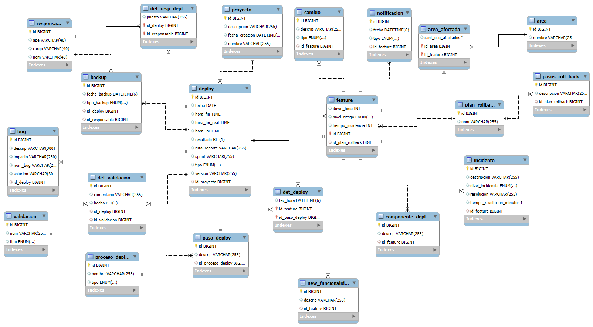

# Sistema de Generación de Reportes al Desplegar
## Descripción del Proyecto
Este proyecto es una aplicación web construida con Spring Boot (Java) que interactúa con una base de datos MySQL y un front-end en Angular 18 para 
centralizar, gestionar y generar reportes detallados sobre el ciclo de vida de los despliegues de software.

El sistema permite auditar la información crítica de cada deploy, incluyendo el impacto, el rollback y los recursos afectados.

El objetivo es apoyar a las pequeñas empresas o startups a gestionar sus despliegues, encaminandolas a una mejora en sus procesos de auditoria

## Arquitectura y Tecnologías

l proyecto sigue una arquitectura de **capas (Controller, Service, Repository)** y utiliza inyección de dependencias por constructor.

| Componente | Tecnología/Lenguaje | Uso |
| :--- | :--- | :--- |
| **Backend** | Java 21+ | Lógica de Negocio (Spring Boot) |
| **Persistencia** | Spring Data JPA / Hibernate | Mapeo Objeto-Relacional (ORM) |
| **Base de Datos** | MySQL | Almacenamiento de datos relacional |
| **Build Tool** | Maven | Gestión de dependencias y compilación |
| **FrontEnd** | Angular 19 | Presentación del proyecto |
---

Modelo fisico de la BD usada

Se instala la libreria de PrimeNG version 19 ademas de TailwindCSS v4 para un diseño UI/UX mejorado
